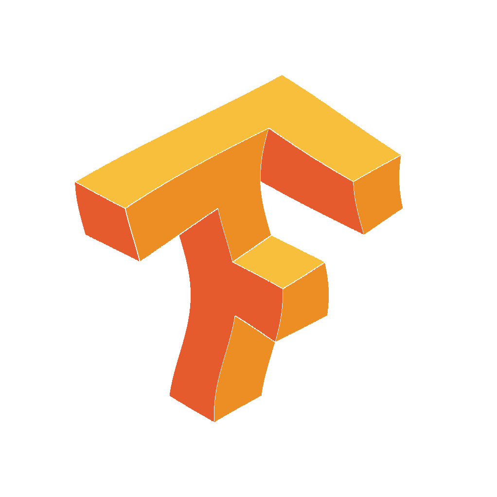
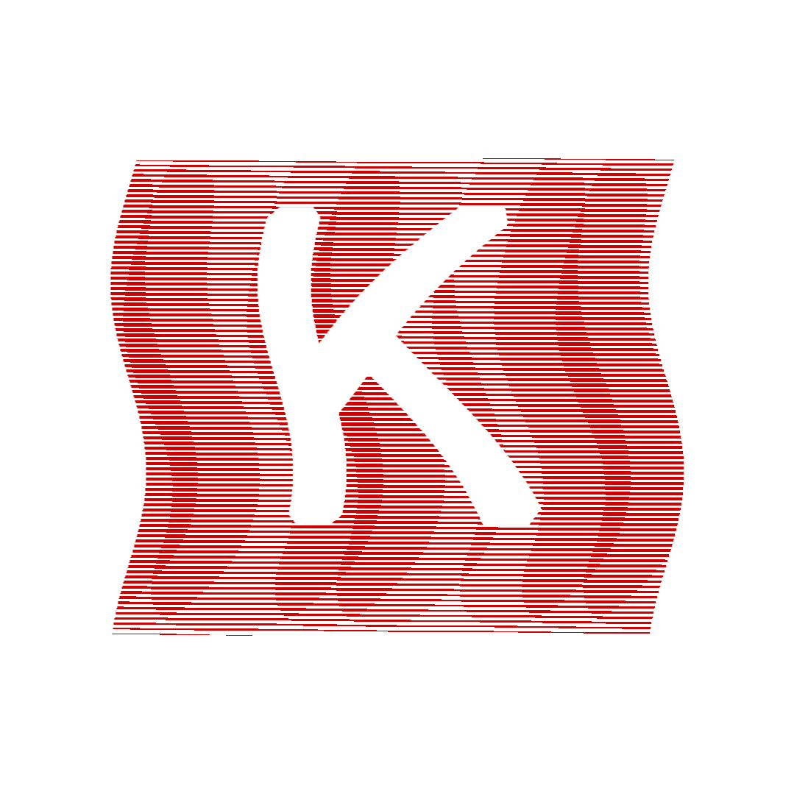
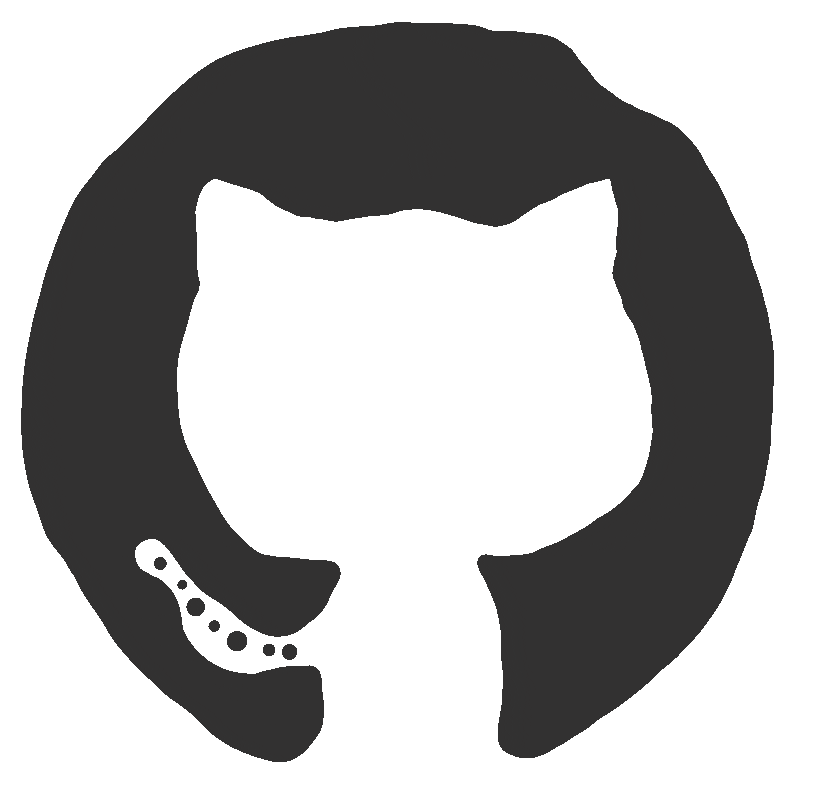
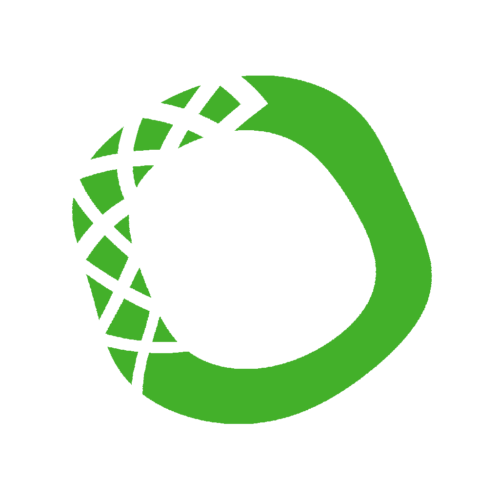

</img>

### :space_invader: &nbsp;About Me

&nbsp;&nbsp;&nbsp;:Student: &nbsp;Final Year BSc Computer Science student. \
&nbsp;&nbsp;&nbsp;:seedling: &nbsp;Love for innovation and a knack for making code run.\
&nbsp;&nbsp;&nbsp;:heartbeat: &nbsp;Passionate about technology.\
&nbsp;&nbsp;&nbsp;:writing_hand: &nbsp;Currently interning at Ineuron.\
&nbsp;&nbsp;&nbsp;:hammer_and_wrench: &nbsp;Special interest towards deep learning.\
&nbsp;&nbsp;&nbsp;:brain: &nbsp; Currently trying to understand GAN .

  &nbsp;&nbsp;&nbsp;&nbsp;
  &nbsp;&nbsp;&nbsp;&nbsp;
  </a>

  
<b>:computer: &nbsp;Main tech knowledge</b>

   
  

  
  

  
<b>:brain: &nbsp;Learning</b>

   
 &nbsp;
 &nbsp;
 &nbsp;
 &nbsp;

  
<b>:gear: &nbsp;Other Skills</b>

   

   </img>

 

